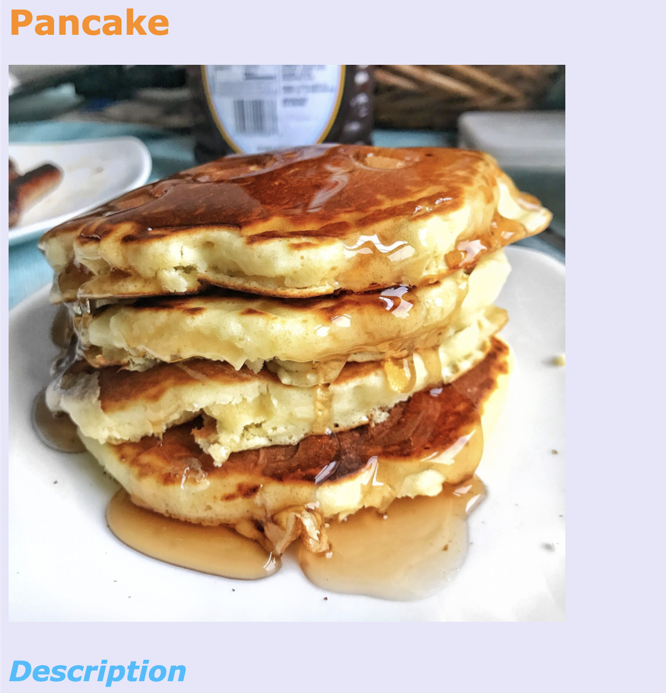

# odin-recipes

## Introduction

This is the first project of [The Odin Project](http://www.theodinproject.com).

The goal is to use all that I've learned previously by creating a recipes website. It will probably be a bit ugly because there is no CSS involved. This is what I should use in this website : 

1. html boilerplate
2. html file organization
3. html tags
```html
    <a href=""></a>
    
    <h1>....<h99>
    <ul>
        <li></li>
    </ul>
    <ol>
        <li></li>
    </ol>    
``` 
Let's check this out. The conclusion will be written after realising the project !
## Conclusion

There was no huge difficulty. The main problem I was facing with is : I am slow. I had to create several lists, and fill them with data, and it was really painful and slow.
Something that could have made the project more sexy would have been to resize pictures correctly.
Anyway, technical aspects went smoothly !

## Conclusion Again

Hello, I didn't know I will come back here. What a pleasure. My wish has become true : I added CSS to my wonderful website. Well... at least now I can't say I didn't work on design. The journey will be long, really long.



